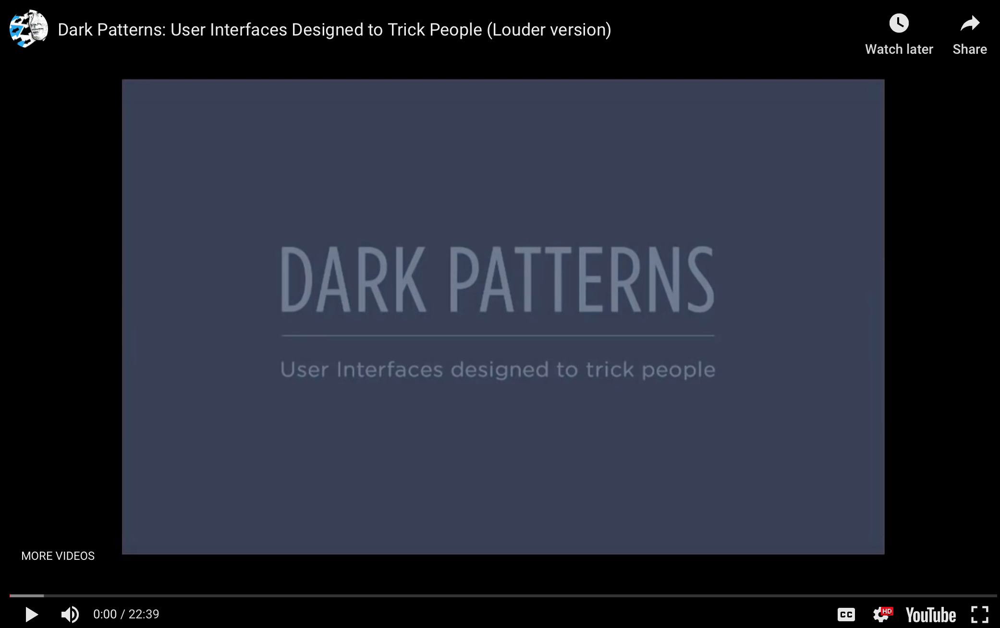

# Practice Assignment

Watch the video below on **Dark Patterns: User Interfaces Design to Trick People** and answer the questions below.

## Video

For more information, visit [the Dark Patterns website](https://darkpatterns.org).

After you've answered the questions below, check out https://guides.github.com/features/mastering-markdown/ to learn how to embed images and also format your text to make it more readable.

Tips:
- Note that there is no spell or grammar check on GitHub. I suggest you use another text editor to write your answers, and then paste and adjust markdown in this document.
- If you want to keep a copy of your own work on GitHub, create a repository using your own account and drop your document in that.

## Questions

1. What is a dark pattern? (In your own words)

2. Using a screenshot/image, give an example from a site online, print publication, or advertisement.

3. Does it fit into one of the categories from the [the Dark Patterns website](https://darkpatterns.org)? If so which one?

4. Why or how do you think your example works?

5. While exploring this topic, what did you learn that you didn't know before.
