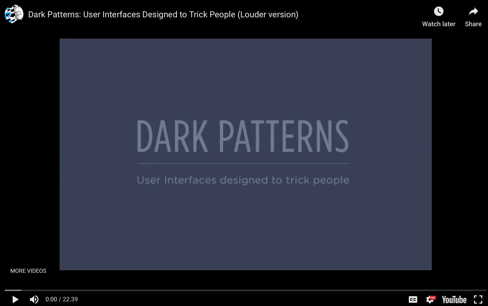

# Practice Assignment

Watch the video below on **Dark Patterns: User Interfaces Design to Trick People** and answer the questions below.

## Video

For more information, visit [the Dark Patterns website](https://darkpatterns.org).

After you've answered the questions below, check out https://guides.github.com/features/mastering-markdown/ to learn how to embed images and also format your text to make it more readable.

Tips:
- Note that there is no spell or grammar check on GitHub. I suggest you use another text editor to write your answers, and then paste and adjust markdown in this document.
- If you want to keep a copy of your own work on GitHub, create a repository using your own account and drop your document in that.

## Questions

**1. What is a dark pattern? (In your own words)**

A deceptive design decision or set of design decisions that create friction in the user experience with the intent of manipulating the user to complete a specific task, give a piece of information, etc.  that’s in the best interest of the organization, business, etc. 

**2. Using a screenshot/image, give an example from a site online, print publication, or advertisement.**

I was shopping for flowers for a friend when I ran into a Dark Pattern in which the image of the flowers that I wanted actually represented a more expensive set of flowers, although advertised at the lowest price. Additionally an item was snuck into my basket without me willingly selecting it. I ended up selecting another set of flowers, only to have my order canceled without any explanation but, I was still charged. They did however make it easy to get a refund. 

Side note: Who knew flowers were so expensive?? 

**3. Does it fit into one of the categories from the [the Dark Patterns website](https://darkpatterns.org)? If so which one?**

This is an example of "Sneak into Basket” - the items were automatically chosen for me and in order to undo them, I had to click on the item - which is counterintuitive given that the first click on an item usually indicates a selection, not de-selection. 

**4. Why or how do you think your example works?**

The original flower choice says $44, when I click on it, it automatically changed my order to the “Deluxe” at $58. When I click the $44, I see that the picture changes to a smaller set of flowers. So my first impression was that for the $44, I would get the flowers shown, little did I know that those flowers were actually the "Deluxe" at $58. Additionally, they’ve included the "Signature Vase," highlighted in a light grey. Honestly, when I went to change my order to the $44 version, my eyes immediately went down to the bright pink "add to basket."

Only then on the next page did I see that the "Signature Vase" was highlighted, now in yellow (the same color as the check out button). The tricky thing about this is that I see the $44 clearly marked to the right of the flowers but, the cost of the vase ($14) is nested within the highlighted box. I then see that my subtotal as $70 - it was only then that I backtracked and found the $14 vase addition. Also a small note, in order to remove the vase, I have to click on the highlighted box - there is no “x” mark. Intuitively, I don’t want to click the vase because that makes me feel like I am selecting it. 

**5. While exploring this topic, what did you learn that you didn't know before.**

I didn’t know that there was a name for these type of design decisions and that they are often (not always) used at the expense of the user and their needs. I’ve absolutely recognized them - sometimes multiple times a day - but, I just thought that it was “annoying” and that “this is just the way this site was set up” or “there is no way to change this.” While some of this design is due to ignorance, not always with malicious intent, it nevertheless still creates a negative experience for the user, leaving them feeling defeated and at times, without control. 

Dark Patterns seem to be the evil twin of UX. As UX designers we are tasked to investigate, research and understand our users habits, needs, etc. in order to create an experience that is best for them. Dark Patterns take all that data, information and knowledge and use it to benefit the organizsation, often times against the users best interet. I am thankful that there are individuals and organizations out there that are targeting this behavior so we can better recognize and hopefully, one day, create a code of ethics that designers must follow. Speaking of ethical code, I listened to an episode of Medium's Podcast - "Play Back" -  titled [Design's Lost Generation](https://medium.com/s/playback/listen-mike-monteiro-reads-designs-lost-generation-9f5c3ae23d08) about just that and how many professions require a license in order to be able to practice their craft (think: lawyers, social workers, doctors, etc.) to prevent abuse and ethical infractions and design should follow suit. Designer Mike Monteiro reads his article and then further makes his claim for design licenses. Some questions I was left with after listening: Who comes up with the ethical codes for digital design? What ethical code do we use, what sources do we pull from? Would this be a “breathing” document as digital/technical trends rapidly change course? 
Would love to hear other's thoughts! You can also read the full article [here](https://medium.com/@monteiro/designs-lost-generation-ac7289549017). 

